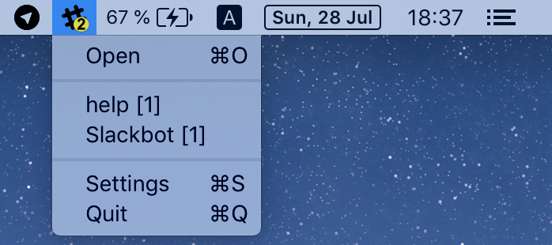
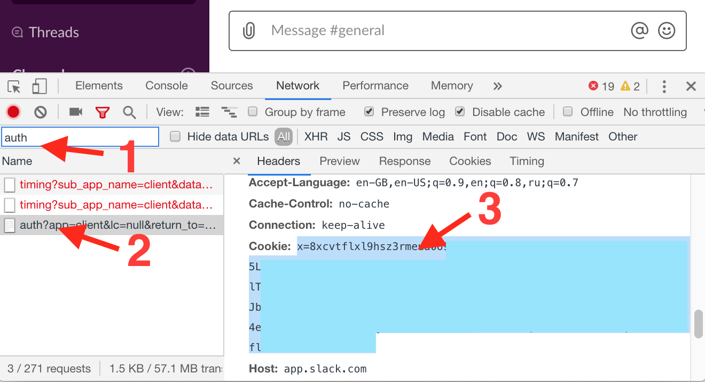

# Slack Status Icon

Simple tool for showing Slack's unread count in MacOS Status Bar.
Very useful with autohidden Dock.

## Setup

For start using tool in `Settings` you needed input one of:
1) legacy slack token (starts with `xoxs-`)
2) browser cookie

## Limitations

- Now app works only with single workspace.
- List of channels/members updates only once per 20 minutes  
(heavy calls, used private API, rate limit is unknown)
- For correct working links from menu you should be logged to the same workspace in desktop client.
